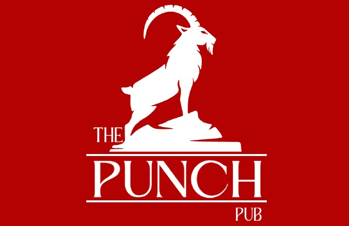
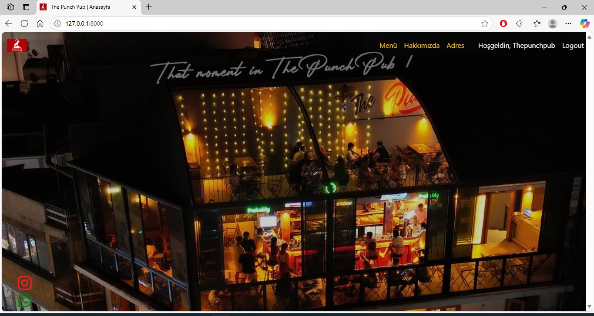
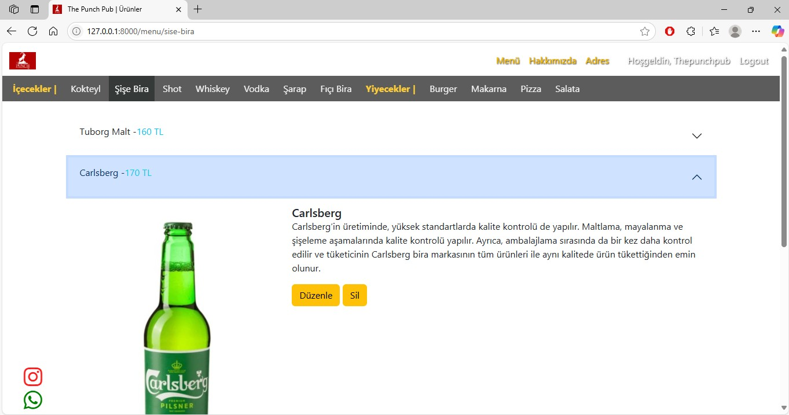
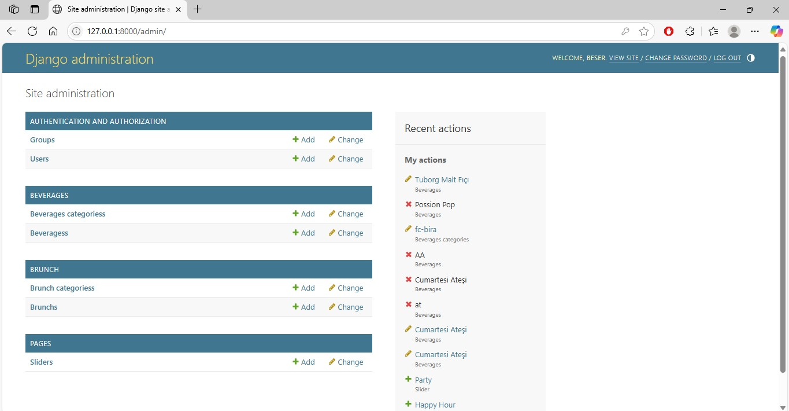
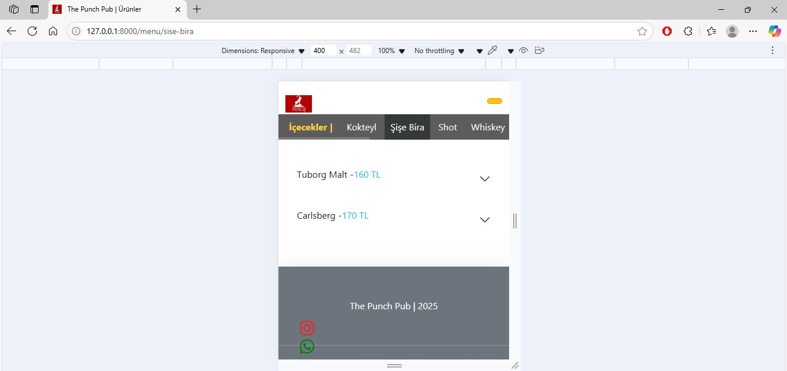

A Django-based pub-web-menu management app. 
<!-- PROJECT LOGO -->
 

  

 

<!-- ABOUT THE PROJECT -->
## About The Project

Web app. to control menu, advertisements with admin panel and staff forms.

(<a href="#readme-top">back to top</a>)

## 🛠 Tech Stack

- Backend: Django
- Frontend: HTML, CSS, Bootstrap, JavaScript
- Database: Sqlite
- Nginx
- Gunicorn

(<a href="#readme-top">back to top</a>)

## ✨ Features

### ✅ Implemented
- User authentication (login/register/logout)
- Menu category
- Leading menu via barcode
- Clean responsive UI (Bootstrap-based)

## 🧱 Architecture

The project follows a hybrid modular architecture:

### Core Apps
- `accounts/` → Account models & business logic
- `beverages/` → Controlling beverages - including is_active area
- `brunch/` → Controlling brunch - including is_active area
- `pages/` → Hangling pages

(<a href="#readme-top">back to top</a>)

## Demo

(<a href="#readme-top">back to top</a>)

## ⚙️ Installation
NOTE: Not ready yet.
git clone https://github.com/nbeser/ThePunchPub.git
cd thepunchpub

python -m venv venv
source venv/bin/activate  # Windows: venv\Scripts\activate

pip install -r requirements.txt

python manage.py migrate
python manage.py runserver

(<a href="#readme-top">back to top</a>)

## 📊 Current Status

The project is published

https://thepunchpub.com

(<a href="#readme-top">back to top</a>)

## 🎯 Purpose

This project demonstrates:

- Scalable Django project architecture
  

(<a href="#readme-top">back to top</a>)

<!-- CONTACT -->
## Contact

Nurettin Beşer - [https://www.instagram.com/zcodingsolutions/](https://www.instagram.com/zcodingsolutions/)

Project Link: [https://github.com/nbeser/BudgetProject/](https://github.com/nbeser/ThePunchPub/)

Contributer : [https://github.com/nbeser](https://github.com/nbeser)

Linkedin : [https://www.linkedin.com/in/nurettin-beser-arcnbsr23](https://www.linkedin.com/in/nurettin-beser-arcnbsr23)

(<a href="#readme-top">back to top</a>)

